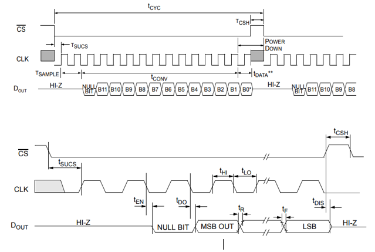
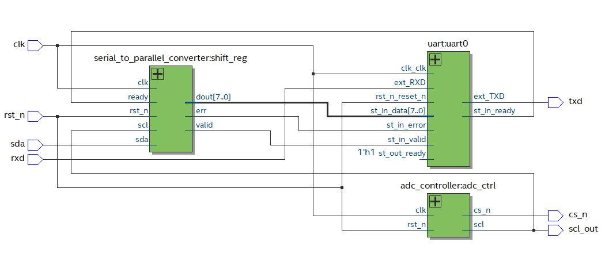
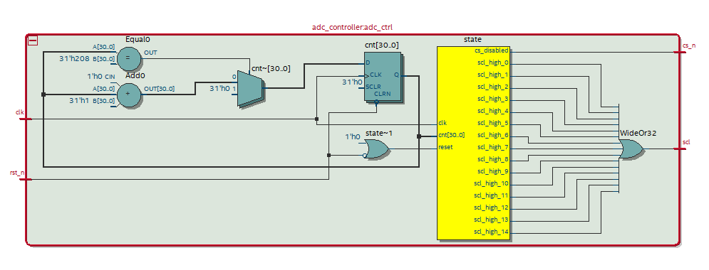

# A/D Converter MCP3201 Interface with FPGA

## Overview

The goal of this project is to interact with the MCP3201 A/D converter, read the data provided by the converter, and send it via the RS-232C serial communication to a computer. The voltage is received as an analog value, converted to a digital value (12 bits), and serves as the primary signal for FPGA processing.

## Specifications

- **Resolution:** 12 bits
- **Operating Voltage:** 2.7V to 5.5V
- **Maximum Sampling Rate:**
  - 100 ksps at VDD = 5V
  - 50 ksps at VDD = 2.7V
- **Clock Speed:** 0.8-1.6 MHz (2.7V to 5V)

### MCP3201 Timing Diagram

### Components

1. MCP3201 A/D Converter
2. RS232 Serial Converter
3. Capacitors
4. DE0 Nano FPGA Board
5. PmodUSBUART

## Simulation

For simulation, the signal CLK is generated, the chip is selected, and data is transmitted to the MCP3201. The 8 most significant bits are extracted for further processing. Finally, the 8 bits are sent to the computer using serial communication.

### Signal Generator Block

The signal generator block generates the CLK, chip selection, and clock signal. It utilizes a state machine to generate a total of 15 clock cycles with two ignored bits and an initial null bit.

### State Machine

The state machine has 32 different states to generate the signal clocks.

### Serial to Parallel Converter Block

The serial to parallel converter block takes the 12 data bits, stores them in a shift register, and sends the 8 most significant bits to the UART for serial communication.

### ModelSim Simulation

## Prototype

### Block Diagram

### Circuit Board

### Pin Planner

### PuTTY Serial Output

- Without Voltage Reference

  

- With Voltage Reference (3.3V)

  

## Conclusion

This project successfully interfaces with the MCP3201 A/D converter, reads analog voltages, and communicates the digital data to a computer through RS-232C. Further improvements and optimizations can be explored for real-world applications.

Feel free to explore the code, contribute, and adapt it for your projects!

